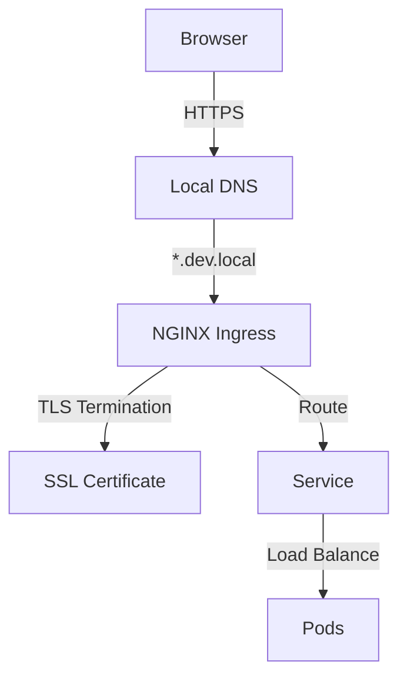

# Local Kubernetes Networking Guide

This guide explains the networking setup for our local Kubernetes development platform using k3d.

## Architecture Overview

Our local platform uses the following components:
- NGINX Ingress Controller for traffic routing
- cert-manager for SSL certificate management
- Local DNS resolution via /etc/hosts
- Environment-specific domains (dev/staging/prod)

### Traffic Flow



## Domain Structure

- Development: `*.dev.local`
  - argocd.dev.local
  - prometheus.dev.local
  - grafana.dev.local
  - app.dev.local
  - api.dev.local
  - docs.dev.local

- Staging: `*.staging.local`
  - argocd.staging.local
  - prometheus.staging.local
  - grafana.staging.local
  - app.staging.local
  - api.staging.local

- Production: `*.prod.local`
  - app.prod.local
  - api.prod.local

## Security Features

1. SSL/TLS:
   - Self-signed certificates for local development
   - Automatic certificate generation and renewal
   - HSTS enabled
   - Modern TLS protocols (1.2, 1.3) only

2. Rate Limiting:
   - Default: 100 requests/minute per IP
   - Configurable per-service
   - 429 status code for exceeded limits

3. Security Headers:
   - CORS configuration
   - XSS protection
   - Content Security Policy
   - Frame options

## Performance Optimization

1. Load Balancing:
   - Least connections algorithm
   - Connection keepalive
   - Upstream keepalive settings

2. Caching:
   - Configurable per-service
   - Browser cache headers
   - Proxy caching for static content

## Troubleshooting Guide

### Common Issues

1. Certificate Errors:
   ```bash
   # Check certificate status
   kubectl get certificate -n ingress-nginx
   
   # View certificate details
   kubectl describe certificate local-wildcard-cert -n ingress-nginx
   ```

2. DNS Resolution:
   ```bash
   # Verify hosts file entries
   grep "local" /etc/hosts
   
   # Update DNS entries
   ./networking/scripts/update-hosts.sh
   ```

3. Connection Issues:
   ```bash
   # Check ingress status
   kubectl get ingress -A
   
   # View ingress controller logs
   kubectl logs -n ingress-nginx deployment/nginx-ingress-controller
   ```

### Monitoring

1. Access Logs:
   - Location: `/var/log/nginx/access.log`
   - JSON format for easy parsing
   - Contains request details, timing, and upstream info

2. Error Logs:
   - Location: `/var/log/nginx/error.log`
   - Debug level configurable
   - Contains detailed error information

## Best Practices

1. Ingress Configuration:
   - Use meaningful host names
   - Configure appropriate timeouts
   - Enable monitoring annotations
   - Set resource limits

2. SSL/TLS:
   - Keep certificates up to date
   - Use appropriate cipher suites
   - Enable HSTS where possible
   - Regular certificate rotation

3. Security:
   - Implement rate limiting
   - Configure security headers
   - Use authentication where needed
   - Regular security audits

## Quick Reference

### Common Commands

```bash
# View all ingress resources
kubectl get ingress -A

# Check ingress controller status
kubectl -n ingress-nginx get pods

# View certificate status
kubectl get certificate -A

# Update local DNS
./networking/scripts/update-hosts.sh

# View ingress logs
kubectl -n ingress-nginx logs -l app.kubernetes.io/name=ingress-nginx
```

### Useful Annotations

```yaml
# Rate limiting
nginx.ingress.kubernetes.io/limit-rpm: "100"

# CORS
nginx.ingress.kubernetes.io/enable-cors: "true"

# SSL Redirect
nginx.ingress.kubernetes.io/ssl-redirect: "true"

# Authentication
nginx.ingress.kubernetes.io/auth-url: "https://auth.dev.local/oauth2/auth"
```

## Support

For additional support or questions:
1. Check the troubleshooting guide above
2. Review the example configurations in `networking/examples/`
3. Consult the NGINX Ingress Controller documentation
4. Open an issue in the repository 